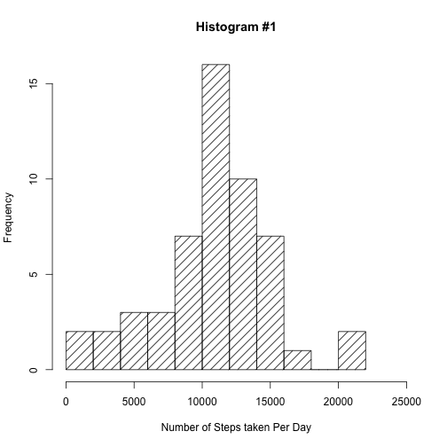
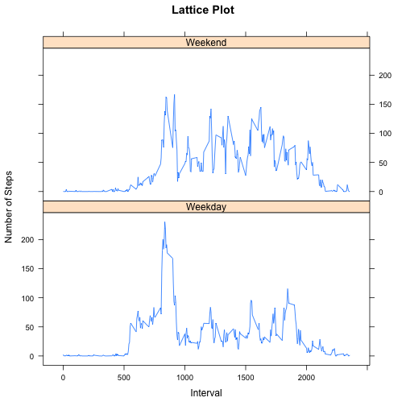

Reproducible Research Peer Assignment 1
===============================================================
#### *Github.com/anesthetize*


### Data import & primary data cleaning 


```r
data <- read.csv("activity.csv", stringsAsFactors = FALSE)
# Loading the 'activity' dataset

data$date <- as.Date(data$date, format = "%Y-%m-%d")
# Converting variable 'date' to Date format

data_cln1 <- subset(data, steps != "NA")
# Subsetting out NA values from the dataset

library(ggplot2)
library(grid)
library(lattice)
```


### Assignment Part 1

The dataframe *data_cln1* is used, where observations having NA values in the steps variable have been removed.    We aggregate the sum of steps for each day using the aggregate function in R.  We also calculate the mean and median number of steps.

#### Preprocessing the data:

```r
data1 <- as.data.frame(aggregate(x = data_cln1$steps, list(data_cln1$date), 
    FUN = sum))
# Aggregating SUM of steps for each day

colnames(data1) <- c("date", "steps")
# Renaming column names

q1_mean <- mean(data1$steps)
q1_median <- median(data1$steps)
```


Now we can proceed with creating the required histogram depicting the number of steps taken per day.

#### Histogram #1:


```r
hist(data1$steps, xlim = range(0, 25000), breaks = 10, density = 10, main = "Histogram #1", 
    xlab = "Number of Steps taken Per Day", ylab = "Frequency")
```

 


Mean number of steps taken per day: **1.0766 &times; 10<sup>4</sup>**    
Median number of steps taken per day: **10765**


### Assignment Part 2 - What is the average daily activity pattern?

We create dataframe data2 that has the mean of steps for each interval.

#### Processing the data:

```r
data2 <- as.data.frame(aggregate(x = data_cln1$steps, list(data_cln1$interval), 
    FUN = mean))
# Aggregating MEAN of steps for every 5-min interval
colnames(data2) <- c("interval", "steps")

q2_max <- subset(data2, steps == max(data2$steps))

q2_max1 <- as.character(q2_max[, 1])
```


#### The Time Series Plot:


```r
plot(data2$interval, data2$steps, type = "l", main = "Time Series Plot", xlab = "Interval", 
    ylab = "Average Steps taken Per Day")
```

 


The interval with the max number of steps averaged across all days is **835**


### Assignment Part 3


#### Imputing missing values

**Methodology**

* The average number of steps *mean_steps* for each interval are calculated from the clean data
* Data with NA values is subsetted to form dataframe *data_miss*
* The NA values are then replaced by variable *mean_steps* via merging across interval
* This data is then appended with the clean data 


This is achieved through the following code chunk:


```r
data_miss <- data[!(data$steps %in% data_cln1$steps), ]
# Extracting rows with NA values in 'steps' variable from first dataset

data_mean <- as.data.frame(aggregate(x = data_cln1$steps, list(data_cln1$interval), 
    FUN = mean))
colnames(data_mean) <- c("interval", "mean_steps")
# Dataframe created with mean of steps across each interval

merge1 <- merge(data_miss, data_mean, by = "interval", all.x = TRUE)
merge1 <- merge1[, -2]
colnames(merge1) <- c("interval", "date", "steps")
# Replaced steps with the mean_steps calculated in dataframe 'data_mean'

data_miss_corrected <- data.frame(merge1$steps, merge1$date, merge1$interval)
colnames(data_miss_corrected) <- colnames(data_cln1)
# Rearranging column positions

data3 <- rbind(data_cln1, data_miss_corrected)
# Appending data_miss_corrected to the cleaned data

data3 <- data3[order(data3$date, data3$interval), ]
# Sorting by date and interval
```


*data3* is the final dataset used for part 3 of the assignment 


#### Calculations

First we aggregate the sum of steps for each date, along with calculating the mean and median sum of steps.


```r
data3_cal <- as.data.frame(aggregate(x = data3$steps, list(data3$date), FUN = sum))
# Aggregating SUM of steps for each day

colnames(data3_cal) <- c("date", "steps")

q3_mean <- mean(data3_cal$steps)
q3_median <- median(data3_cal$steps)
```


Now we simple create a histogram for steps.

#### Histogram #2:


```r
hist(data3_cal$steps, angle = 15, xlim = range(0, 25000), breaks = 10, density = 10, 
    main = "Histogram #2", xlab = "Number of Steps taken Per Day", ylab = "Frequency")
```

 


Mean number of steps taken per day: **1.0766 &times; 10<sup>4</sup>**  
Median number of steps taken per day: **1.0766 &times; 10<sup>4</sup>**

#### Do these values differ from the estimates from the first part of the assignment? 

The mean remains exactly the same and the median changes by 1.

#### What is the impact of imputing missing data on the estimates of the total daily number of steps?
Imputing missing data does not vary the shape of the graph much and the distribution of daily number of steps are in proportion to the previous results.
The median increases by a value of 1 step.


### Assignment Part 4

#### Data cleaning

We first transform dataframe data3 to capture the weekdays using weekdays() function


```r
data4 <- transform(data3, Weekday = weekdays(as.Date(date)))

str(data4$Weekday)
```

```
##  Factor w/ 7 levels "Friday","Monday",..: 2 2 2 2 2 2 2 2 2 2 ...
```


Clearly Weekday is a factor variable, which we convert into a character variable.

Then we create a variable *Weekday_flag* which has values "Weekend" and "Weekday" using the ifelse function.


```r
data4$Weekday <- as.character(data4$Weekday)

# Subsetting weekends and weekdays via variable Weekday_flag
data4$Weekday_flag <- ifelse(data4$Weekday %in% c("Saturday", "Sunday"), "Weekend", 
    "Weekday")
```


#### Calculations 

We take the mean of steps for intervals and weekday_flag using the aggregate function.


```r
data4_cal <- as.data.frame(aggregate(x = data4$steps, list(data4$interval, data4$Weekday_flag), 
    FUN = "mean"))
colnames(data4_cal) <- c("interval", "Weekday_flag", "steps")
```


Finally we plot the number of steps v/s interval grouped across weekday_flag.  The lattice plotting system is employed.

#### The time-series panel plot:


```r
library(lattice)

xyplot(data4_cal$steps ~ data4_cal$interval | data4_cal$Weekday_flag, type = "l", 
    layout = c(1, 2), xlab = "Interval", ylab = "Number of Steps", main = "Lattice Plot")
```

 


#### Are there any difference in activity patterns between weekdays and weekends?

* It appears that the weekend patterns are more consistent across intervals than weekday patterns
* The highest peak in steps is witnessed in weekday patterns
* The weekday hike in number of steps begins in weekday patterns for lower intervals than weekend patterns
